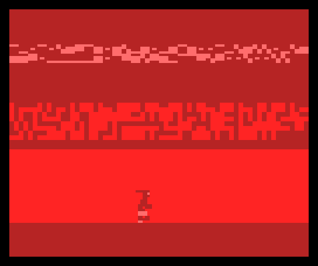

# BeastBAS
BeastBAS is an horizontal scroller inspired by Shadow of the Beast in 10 lines of MSX2 BASIC v3.



# Game Logic
Player explore a cave and try to avoid enemy's shots jumping.

# Controls
- Left and Right Arrow to move
- SPACEBAR to jump

Sources are stored at: https://github.com/robertocapuano/BeastBAS

# Installation
Game was developed in MSX-BASIC v3 on a MSX2+. Emulator is available at https://webmsx.org/
1. connect to https://webmsx.org/
2. click on the first floppy icon below the blue screen
3. Select "Add Disk Images"
4. Choose "candy.dsk"
5. type in:
```
load "a:beast.bas"
run
```

otherwise
1. connect to https://webmsx.org/
2. press ALT+B
3. copy and paste source code
5. type in:
```
run
```

WebMSX Launch URL:
- https://webmsx.org?MACHINE=MSX2P&DISK=https://raw.githubusercontent.com/robertocapuano/CandyBAS/PUR120/candy.dsk&BASIC_RUN=beast.bas

MSXPen link:
- https://msxpen.com/codes/-M1tl2_cHDuasN2gmIbj

# Source Description

```
1 DATA 00,00,0F,01,01,01,03,03,07,06,07,00,00,06,07,00, 00,00,C0,80,C0,80,80,80,E0,E0,00,00,00,C0,C0,00, 00,00,00,00,00,00,00,00,00,00,00,07,07,00,00,06, 00,00,00,40,00,00,00,00,00,00,00,80,80,00,00,00, 00,00,0F,01,01,01,03,07,07,05,07,00,00,1C,18,00
2 DATA 00,00,C0,80,C0,80,80,80,C0,C0,00,00,40,60,60,00, 00,00,00,00,00,00,00,00,00,00,00,07,07,00,00,00, 00,00,00,40,00,00,00,00,00,00,00,80,80,00,00,60, 00,00,07,03,07,03,03,03,0F,0E,01,00,00,06,07,00, 00,00,E0,00,00,00,80,80,C0,C0,C0,00,00,C0,C0,00
3 DATA 00,00,00,04,00,00,00,00,00,00,00,03,03,00,00,00, 00,00,00,00,00,00,00,00,00,00,00,C0,C0,00,00,C0, 00,00,07,03,07,03,03,03,07,07,01,00,04,0C,0C,00, 00,00,E0,00,00,00,80,C0,C0,40,C0,00,00,70,30,00, 00,00,00,04,00,00,00,00,00,00,00,03,03,00,00,0C
4 DATA 00,00,00,00,00,00,00,00,00,00,00,C0,C0,00,00,00, 00,00,00,00,00,00,03,02,05,02,03,00,00,00,00,00, 00,00,00,00,00,00,00,C0,60,C0,00,00,00,00,00,00, 
```
- Line 1-4 contains sprites binary data.

```
5 color 8,6,1:SCREEN 5,3,0: cls :KEYOFF:DEFINTA-Z: :open"grp:"as#1:S=&h7800:forI=0to287:READ R$:VPOKE S+I,VAL("&H"+R$):NEXTI:X=100:Y=150:H =0:F=0:E=0:DX=0:PUTSPRITE 2,(220,0),6,8
```
- SCREEN1: select 32x24 text mode
- COLOR10,9,9: select color yellow on red
- KEY OFF: hide command bar
- DEF INT A-Z: set A-Z as integer variables
- C=1,R=0: initial cursor position, column 1, row 0
- B=6283: base video memory address for screen1
- Z=RND(-TIME): initialize random number generator
- print title and wait a key
- CLS: clear screen

```
6 pset(0,30):color9:forI=0to61:print#1,chr$(&hc0+RND(1)*6);:nextI:pset(0,80):color8:for i=0to124:print#1,chr$(&hdb+RND(1)*4);:nextI:LINE(00,120)-(300,182),8,BF:PUTSPRITE0,(X,Y),6,0:PUTSPRITE 1,(X,Y),9,1: play "O4C4G4R4R4D4C4D4"
```
- 

```
7 Y=Y+DY:DY=DY-SY:vpoke30208,Y:vpoke30212,Y:if E=1 then vpoke30217,XX:XX=XX+DX:if(XX<5orXX>250)thenE=0:vpoke30216,0:elseifXX>95andXX<105andY>120thenE=0:YY=0:XX=0:vpoke30216,YY:vpoke30217,XX:PLAY"M30000O4D"
```
- 
```
8 if (A=1 and Y>=150) thenDY=0:SY=0 :Y=150:A=0:elsek=0:K$=inkey$:IFK$=""then7:elsek=asc(k$): if k=28 then H=H+6:F=F+1:FR=0:else if k=29 thenH=H-6:F=F+1:FR=4: else if k=32andSY=0 then DY = -8: SY=-1:A=1
```
- 
```
9 if E=0 and RND(1)>.8 then E=1: S=SGN(RND(1)-.5) : DX = S* (RND(1)+.5) * 5 :XX=(220-S*200)/2:vpoke30216,150:vpoke30217,XX
```
- 
```
10 h=(H+255)mod255:SETSCROLL H,0,1,1:if(Fmod4)=0thenFR=FR+2*(F/4mod2):vpoke30210,FR*4:vpoke30214,(FR+1)*4:goto7:else7
```
- 
